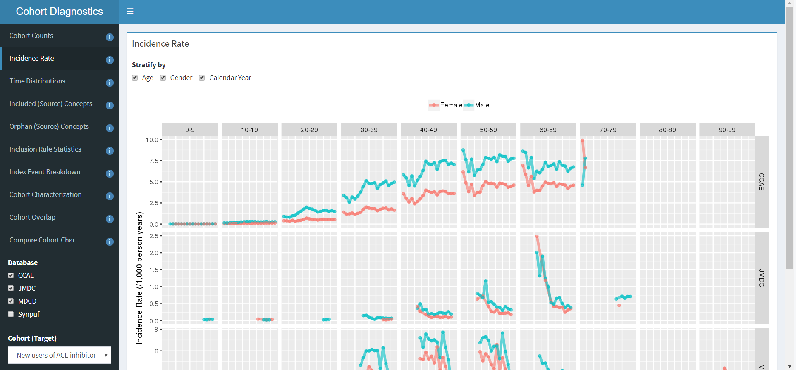

```{r, echo = FALSE, message = FALSE}
library(SqlRender)
knitr::opts_chunk$set(
  cache = FALSE,
  comment = "#>",
  error = FALSE,
  tidy = FALSE)
```

# Viewing the diagnostics

The Diagnostics Explorer shiny application is able to present the results output of Cohort Diagnostics in either local mode (i.e. using premerged file) or database mode (connected to postgres database server). The Shiny app can be found [here](https://github.com/OHDSI/CohortDiagnostics/tree/master/inst/shiny/DiagnosticsExplorer). Make sure to copy all files in the `DiagnosticsExplorer` folder. When launching the application. You maybe asked to install additional packages required by the app, such as shiny, shinydashboard, shinyWidgets, DT, htmltools, scales, plotly, dplyr, purrr, tidyr, ggiraph.



Note that each of the tabs on the left has an information icon. Clicking on these icons will show additional information on each diagnostic, how they were computed, and how they may be interpreted.

# Launching Diagnostics Explorer

- From R, launch the DiagnosticExplorer shiny application by calling the 'launchDiagnosticsExplorer()' function of CohortDiagnostics. 
- From R-studio, you may start the project by clicking on the 'DiagnosticsExplorer.Rproj' in the shiny folder, then open the global.R and press the 'RunApp' button.
From R-server (shiny server), you will need to copy all the files in the DiagnosticsExplorer shiny app into a folder on the server. The server should automatically launch the application (please talk to the shiny server administrator for your site specific rules.)


# Running the app using local file mode (Premerged file).

Local mode is the most common mode to run the Shiny application. We recommend that you convert all the csv files that are the precomputed output of Cohort Diagnostics into a .RData file as follows

```{r tidy=FALSE,eval=FALSE}
preMergeDiagnosticsFiles("C:/temp/allZipFiles")
```
.RData files enables faster load of the Shiny application. Once you have converted your results data into a premerged file, you may launch the Diagnostics Explorer app as follows:

```{r tidy=FALSE,eval=FALSE}
launchDiagnosticsExplorer(dataFolder = "C:/temp", dataFile = "Premerged.RData")
```
If running the application from a R-studio environment, please make sure the 'Premerged.RData' is in a folder called 'data'. Go to global.R and to the line that `defaultDatabaseMode <- FALSE `. Ensure defaultDatabaseMode is FALSE. This will prevent the application from attempting to connect to a remote database system, and only look for local premerged.RData file.

# Running the app using Database mode

We recommend the use of a database system, when file size of the cohort diagnostics output becomes large e.g. > 100mb, as using the premerged.RData may leading sluggish performance. Currently only postgres server is supported. See Vignette on Database mode on how to load data into remote database.


# Running over the network
If you want to run the application over the network then set `runOverNetwork = TRUE` while launching the application using 'launchDiagnosticsExplorer()'. This will make the shiny application available over your network (i.e. within your networks firewall).